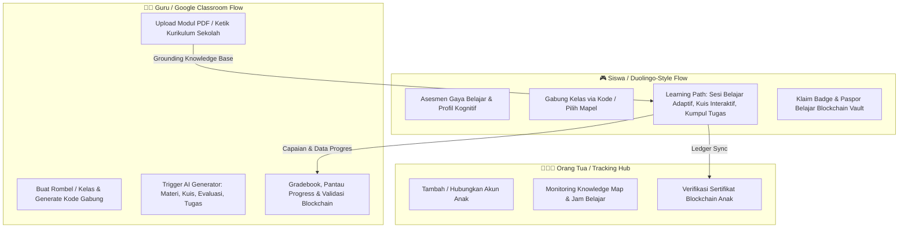

# 📄 Product Requirements Document (PRD) — EduAdapt Platform

**Nama Produk**: EduAdapt (Platform E-Learning Adaptif K-12 Berbasis AI Brain & Blockchain Vault)  
**Institusi**: Riset Hibah Fundamental Universitas Udayana  
**Target Pengguna**: Siswa (SD Kelas 1 – SMA Kelas 12), Guru / Sekolah, Orang Tua  
**Filosofi Inti**: 
- 🧠 **AI = Otak Adaptif**: Menganalisis gaya belajar, generate materi/kuis/tugas ter-grounding tanpa halusinasi, dan mengatur Dynamic Difficulty Adjustment (DDA).
- 🔐 **Blockchain = Brankas Aman (Secure Vault)**: Pencatatan rekam jejak capaian, nilai evaluasi, dan sertifikat kompetensi permanen anti-manipulasi.

---

## 1. Visi & Tujuan Produk

1. **Personalisasi Nyata**: Mengakhiri era kurikulum "satu ukuran untuk semua" dengan memetakan gaya belajar (Visual, Auditori, Kinestetik) dan kecepatan kognitif siswa lewat Initial Ability Assessment.
2. **Kedaulatan Guru & Anti-Halusinasi**: AI tidak mengarang bebas dari internet; seluruh materi, kuis, ulangan, dan tugas di-generate 100% dari modul PDF dan teks silabus yang diunggah guru.
3. **Gamifikasi Playful (Duolingo-Inspired)**: Menghilangkan rasa takut belajar pada anak SD-SMA dengan learning path bertahap (stepping stone path), poin XP, streak harian, dan feedback ramah.
4. **Keamanan & Kredibilitas Transparan**: Ijazah mikro dan capaian belajar siswa dikunci pada ledger blockchain yang dapat diverifikasi publik melalui QR code.

---

## 2. Arsitektur Peran Pengguna (User Roles)



---

## 3. Spesifikasi Fungsional Per Modul

### 3.1 Portal Siswa (Playful & Gamified Learning Path)
1. **Initial Ability & Learning Style Assessment**:
   - 5-8 pertanyaan interaktif cepat saat pertama login untuk mengidentifikasi modalitas (Visual, Logika, Konseptual) dan kecepatan pemrosesan.
   - Menghasilkan **Peta Jalur Belajar (Learning Journey Map)** berbentuk pulau/stepping stones bertingkat.
2. **Sesi Belajar AI Adaptif**:
   - Penjelasan materi bertingkat dengan tombol AI Companion: *Analogi Sederhana*, *Visual Diagram*, *Langkah Rinci*.
   - **Dynamic Difficulty Adjustment (DDA)**: Soal menyesuaikan tingkat kesulitan secara instan (Mudah → Sedang → Menantang → Mahir) berdasarkan akurasi dan waktu berpikir.
3. **Kuis, Ulangan Evaluasi, & Pengumpulan Tugas**:
   - Kuis interaktif dengan umpan balik instan + XP reward.
   - Ulangan evaluasi terjadwal dari guru dengan timer & anti-cheat check.
   - Pengumpulan tugas: Upload dokumen/foto catatan atau input teks langsung dengan status review guru.
4. **Blockchain Learning Passport (Vault)**:
   - Sertifikat kompetensi per bab lengkap dengan Hash Transaksi, Timestamp, dan QR Code verifikasi.
   - Mode Offline Sync: Mengerjakan modul tanpa koneksi internet, lalu sinkronisasi otomatis ke blockchain saat kembali online.

---

### 3.2 Portal Guru (Classroom Management & Grounded AI Hub)
1. **Manajemen Rombongan Belajar (Rombel / Kelas)**:
   - Buat kelas per mata pelajaran & jenjang (Contoh: *Kelas 10-IPA-1 Matematika*).
   - Generate **Kode Gabung Kelas (Class Code)** 6 digit unik untuk siswa.
   - Daftar anggota kelas, invite siswa via email/ID, dan manajemen kelompok belajar.
2. **Grounded Curriculum & Document Knowledge Base**:
   - Drag-and-drop upload modul/buku ajar PDF (otomatis di-parse ke vector context).
   - Rich text editor untuk input manual Capaian Pembelajaran (CP) dan Tujuan Pembelajaran (TP).
   - Toggle **"Strict School Grounding (Anti-Halusinasi)"**: AI dikunci 100% pada dokumen guru.
3. **AI Task & Assessment Generator**:
   - Guru memilih bab & tingkat kompetensi → AI men-generate draf kuis pilihan ganda, soal uraian berbobot, atau studi kasus berbasis materi yang diunggah.
   - Guru dapat mengedit, menambah, atau menyetujui soal sebelum dipublikasikan ke siswa.
4. **Gradebook & Live Classroom Analytics**:
   - Dashboard pemantauan progres seluruh siswa dalam satu tabel/matriks.
   - Notifikasi siswa yang membutuhkan bimbingan khusus (*Need Intervention Alert*).
   - Penerbitan massal sertifikat blockchain kelas (*Batch Mint Credential*).

---

### 3.3 Portal Orang Tua (Child Tracking & Wellbeing Center)
1. **Multi-Child Account Binding**:
   - Orang tua memasukkan ID Anak / Kode Verifikasi Siswa untuk menghubungkan akun.
2. **Knowledge Map (Radar Kompetensi)**:
   - Grafik radar pemahaman topik (Matematika, Sains, Bahasa, Informatika).
   - Penjelasan naratif AI ramah orang tua mengenai kemajuan belajar anak.
3. **Digital Wellbeing & Study Habit Tracker**:
   - Grafik waktu belajar harian vs waktu istirahat.
   - Rekomendasi pendampingan belajar di rumah yang dipersonalisasi.

---

## 4. Spesifikasi Teknis & Data Schema Ringkas

```typescript
// Entitas Kelas & Rombel
interface Classroom {
  id: string;
  name: string; // "Matematika Kelas 10-A"
  grade: number; // 1 - 12
  subject: string; // "Matematika"
  joinCode: string; // "UDU782"
  teacherId: string;
  studentIds: string[];
  groundedDocuments: GroundedDocument[];
}

// Entitas Grounding Dokumen Guru
interface GroundedDocument {
  id: string;
  title: string;
  fileUrl?: string;
  rawTextContent: string;
  uploadedAt: string;
  status: 'processing' | 'ready' | 'error';
  targetClassId: string;
}

// Entitas Soal & Tugas Ter-Grounding
interface GroundedTask {
  id: string;
  classId: string;
  type: 'material' | 'quiz' | 'exam' | 'assignment';
  title: string;
  sourceReference: string; // "Bab 4 Halaman 52 Modul Guru"
  content: any;
  difficultyLevel: 'basic' | 'medium' | 'challenging' | 'mastery';
  dueDate?: string;
}

// Entitas Blockchain Passport Record
interface BlockchainCredential {
  certificateId: string;
  studentId: string;
  competencyTitle: string;
  score: number;
  blockHash: string;
  transactionId: string;
  issuedAt: string;
  verifiedBy: string; // "SMAN 1 Denpasar & Universitas Udayana"
}
```

---

## 5. Metrik Keberhasilan (Success Metrics)
- **Tingkat Retensi Belajar**: Peningkatan *completion rate* modul siswa ≥ 35% berkat sistem gamifikasi Duolingo-style & DDA.
- **Akurasi AI Grounding**: 0% halusinasi pada materi kuis dan penjelasan tutor terverifikasi dokumen guru.
- **Integritas Kredensial**: 100% sertifikat dapat diverifikasi desentralisasi tanpa ketergantungan database tunggal.
