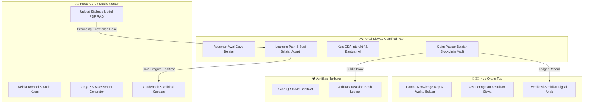

# 🎓 EduAdapt Platform

<div align="center">


[](https://react.dev/)
[](https://www.typescriptlang.org/)
[](https://vitejs.dev/)
[](https://tailwindcss.com/)
[](https://vitest.dev/)
[](LICENSE)

**Platform E-Learning Adaptif K-12 Berbasis AI Brain & Blockchain Secure Vault**  
*Riset Hibah Fundamental Universitas Udayana*

</div>

---

## 📌 Ringkasan Proyek (Overview)

**EduAdapt** adalah platform pembelajaran digital adaptif yang dirancang untuk siswa K-12 (SD Kelas 1 hingga SMA Kelas 12), guru, dan orang tua. Platform ini mengintegrasikan dua pilar teknologi utama:

1. 🧠 **AI Adaptive Brain (Dynamic Difficulty Adjustment & RAG)**:
   - Menyesuaikan tingkat kesulitan soal secara dinamis (*Mudah* ➔ *Sedang* ➔ *Menantang* ➔ *Mahir*) berdasarkan performa dan waktu respons siswa.
   - Pembangkitan materi dan kuis ter-grounding 100% dari silabus/PDF guru guna mencegah halusinasi AI.
2. 🔐 **Blockchain Vault (Kredensial Transparan & Anti-Manipulasi)**:
   - Pencatatan capaian belajar, badge kompetensi, dan sertifikat digital ke dalam ledger permanen yang dapat diverifikasi secara publik via kode QR / hash verifikasi.
3. 🎮 **Gamifikasi Pembelajaran Interaktif (Duolingo-Inspired)**:
   - Jalur belajar berupa *stepping stones* pulau bertingkat, XP rewards, *daily streaks*, avatar leveling, dan feedback apresiatif yang ramah anak.

---

## 🏛️ Arsitektur Peran Pengguna (User Roles)



---

## 🚀 Tech Stack

- **Framework**: [React 19](https://react.dev/) + [Vite 6](https://vitejs.dev/)
- **Bahasa**: [TypeScript 5](https://www.typescriptlang.org/)
- **Styling**: [Tailwind CSS v4](https://tailwindcss.com/) + Custom Claymorphism / Neumorphism Tokens
- **Komponen UI**: [Radix UI Primitives](https://www.radix-ui.com/), [Lucide React Icons](https://lucide.dev/), [Canvas Confetti](https://www.npmjs.com/package/canvas-confetti)
- **Routing**: [React Router v7](https://reactrouter.com/)
- **Pengujian**: [Vitest](https://vitest.dev/) + [Testing Library](https://testing-library.com/)
- **CI/CD**: GitHub Actions

---

## 📂 Struktur Direktori

```text
Platform-Pembelajaran-Adaptif/
├── .github/
│   └── workflows/
│       └── ci.yml               # GitHub Actions CI Workflow
├── frontend/                    # Aplikasi Web Frontend (React + Vite)
│   ├── public/                  # Static assets & PWA manifest
│   ├── src/
│   │   ├── __tests__/           # Unit & Integration Tests (Vitest)
│   │   ├── components/          # Reusable UI & Layout Components
│   │   ├── contexts/            # Global App Context & State
│   │   ├── lib/                 # Utilitas & Helper Functions
│   │   ├── pages/               # Halaman Aplikasi (Siswa, Guru, Orang Tua, dsb.)
│   │   ├── services/            # Logika DDA Engine, RAG Mock, Blockchain Vault
│   │   ├── types/               # TypeScript Interface & Type Definitions
│   │   ├── App.tsx              # Router & Route Configurations
│   │   └── main.tsx             # Entry Point React
│   ├── package.json             # Dependensi & Script Frontend
│   ├── vite.config.ts           # Konfigurasi Vite
│   └── vitest.config.ts         # Konfigurasi Unit Test Vitest
├── .gitignore                   # Root Git Ignore
├── PRD.md                       # Product Requirements Document
├── SPEC.md                      # Technical Specification Document
└── README.md                    # Dokumentasi Utama Repositori
```

---

## 🛠️ Panduan Memulai (Quick Start)

### Prasyarat
- **Node.js**: `v18.0.0` atau lebih baru (Disarankan `v20+`)
- **npm**: `v9.0.0` atau lebih baru

### 1. Kloning Repositori
```bash
git clone https://github.com/<username>/Platform-Pembelajaran-Adaptif.git
cd Platform-Pembelajaran-Adaptif/frontend
```

### 2. Instalasi Dependensi
```bash
npm install
```

### 3. Konfigurasi Environment (Opsional)
Salin contoh file `.env`:
```bash
cp .env.example .env
```

### 4. Menjalankan Server Development
```bash
npm run dev
```
Buka browser di `http://localhost:5173`.

---

## 🧪 Pengujian & Build

```bash
# Menjalankan unit tests
npm run test

# Menjalankan type-checking dan build production
npm run build

# Menjalankan preview build production
npm run preview
```

---

## 📚 Dokumentasi Terkait

- [PRD (Product Requirements Document)](./PRD.md)
- [Technical Specification](./SPEC.md)
- [Design Guide (Frontend)](./frontend/DESIGN.md)

---

## 📄 Lisensi

Proyek ini berada di bawah lisensi [MIT](LICENSE).
