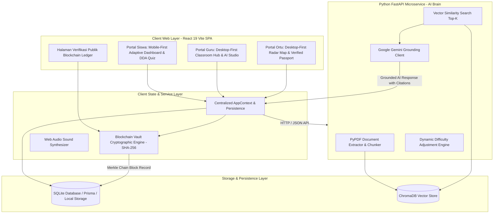
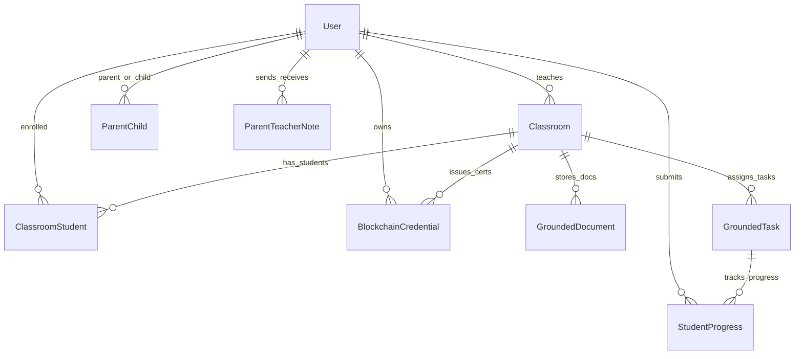
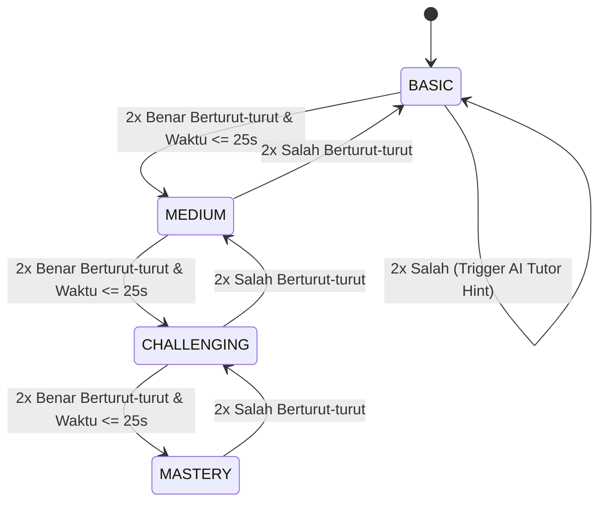

# System Technical Specification (SPEC.md) — EduAdapt Platform

**Nama Sistem**: EduAdapt (Platform E-Learning Adaptif K-12 Berbasis AI Brain & Blockchain Vault)  
**Institusi**: Riset Hibah Fundamental Universitas Udayana  
**Versi Dokumen**: 2.0.0  
**Status**: Approved & Aligned to Active Implementation  
**Target Arsitektur**: Pure React 19 (Vite SPA) + FastAPI (Python AI Engine) + ChromaDB + SQLite/Prisma + SHA-256 Blockchain Ledger  

---

## 1. Ikhtisar Sistem & Arsitektur Tingkat Tinggi (System Architecture)

EduAdapt dirancang dengan pendekatan arsitektur terpisah yang membagi lapisan antarmuka pengguna interaktif (Client SPA), mesin komputasi kecerdasan buatan berbasis dokumen guru (AI Microservice), dan buku besar kriptografis anti-manipulasi (Blockchain Vault).



### 1.1 Komponen Inti Arsitektur
1. **Frontend Client (Pure React 19 + Vite)**:
   - React 19 SPA dengan React Router v7 (`react-router-dom`).
   - Tailwind CSS dengan sistem desain taktil Claymorphism solid berlatar `#F8F9FD` dan token warna pastel terkalibrasi.
   - Web Audio API synthesizer untuk efek suara interaksi tanpa ketergantungan berkas audio eksternal.
   - Layout Mobile-First untuk Siswa; Layout Desktop-First Responsif dengan Sidebar untuk Guru dan Orang Tua.
2. **AI Brain Microservice (FastAPI + Python 3.10+)**:
   - Ekstraksi PDF modul ajar guru via PyPDF.
   - Semantic Chunking & Vector Search via ChromaDB.
   - Strict Grounding Prompting via Google Gemini API dengan kepatuhan zero-hallucination.
   - Standalone Dynamic Difficulty Adjustment (DDA) calculator.
3. **Database & Persistence Layer**:
   - Manajemen relasi kelas, siswa, guru, orang tua, dokumen grounding materi, tugas adaptif, riwayat pengerjaan, dan catatan ledger rantai blok.
4. **Blockchain Credential Vault (Cryptographic SHA-256 Ledger)**:
   - Hashing deterministik berbasis Hash chaining (`blockIndex`, `previousHash`, `blockHash`, `transactionId`).
   - Akses manajemen sertifikat dialokasikan secara eksklusif untuk **Guru** (penerbitan) dan **Orang Tua** (pemantauan & verifikasi).

---

## 2. Spesifikasi Skema Basis Data (Database Schema)



### 2.1 Definisi Entitas & Kolom

#### A. Tabel User
Menyimpan data identitas pengguna lintas 3 peran (Siswa, Guru, Orang Tua).
| Kolom | Tipe Data | Modifiers | Keterangan |
|---|---|---|---|
| id | String | PK, cuid | Unique user identifier |
| email | String | Unique | Alamat surel akun |
| passwordHash | String | Required | Hash kata sandi |
| name | String | Required | Nama lengkap pengguna |
| role | String | Default: "SISWA" | Enum: "SISWA", "GURU", "ORTU" |
| learningStyle | String | Nullable | Enum: "VISUAL", "AUDITORI", "KINESTETIK" |
| modalityScores | JSON | Nullable | Objek skor persentase { visual, audio, practice } |
| processingSpeed | String | Default: "MODERATE" | Enum: "FAST", "MODERATE", "DELIBERATE" |
| xpTotal | Int | Default: 0 | Akumulasi XP gamifikasi siswa |
| streakDays | Int | Default: 1 | Jumlah hari berturut-turut belajar |
| hearts | Int | Default: 5 | Sistem nyawa latihan siswa (1-5) |
| currentDDALevel | String | Default: "MEDIUM" | Enum: "BASIC", "MEDIUM", "CHALLENGING", "MASTERY" |
| createdAt | DateTime | default(now) | Waktu registrasi |

#### B. Tabel Classroom
Menyimpan rombongan belajar (rombel) yang dibuat oleh guru.
| Kolom | Tipe Data | Modifiers | Keterangan |
|---|---|---|---|
| id | String | PK, cuid | ID kelas |
| name | String | Required | Contoh: "Biologi Kelas 10-A" |
| grade | Int | Required | Jenjang kelas 1 – 12 (SD/SMP/SMA) |
| subject | String | Required | Mata pelajaran ("Biologi", "Matematika", dll) |
| joinCode | String | Unique | 6-karakter kode gabung unik (misal: "UDU802") |
| teacherId | String | FK -> User.id | Guru penanggung jawab |
| createdAt | DateTime | default(now) | Waktu pembuatan kelas |

#### C. Tabel ClassroomStudent
Tabel pivot relasi banyak-ke-banyak antara Siswa dan Kelas.
| Kolom | Tipe Data | Modifiers | Keterangan |
|---|---|---|---|
| classroomId | String | PK (Komposit), FK | Relasi ke Classroom.id |
| studentId | String | PK (Komposit), FK | Relasi ke User.id |
| joinedAt | DateTime | default(now) | Waktu bergabung |

#### D. Tabel GroundedDocument
Menyimpan teks hasil parsing PDF modul ajar guru yang menjadi sumber kebenaran tunggal RAG.
| Kolom | Tipe Data | Modifiers | Keterangan |
|---|---|---|---|
| id | String | PK, cuid | ID dokumen materi |
| classroomId | String | FK -> Classroom.id | Kelas pemilik materi |
| title | String | Required | Judul modul (misal: "Bab 3 Sistem Pencernaan.pdf") |
| fileUrl | String | Nullable | Path / URL file PDF asli |
| rawText | String | Required (Text) | Teks hasil ekstraksi PyPDF |
| chunksCount | Int | Default: 0 | Jumlah vektor chunk yang diindeks |
| vectorId | String | Required | Vector reference pada ChromaDB |
| status | String | Default: "READY" | "PROCESSING", "READY", "ERROR" |
| uploadedAt | DateTime | default(now) | Waktu unggah |

#### E. Tabel GroundedTask
Menyimpan kuis, materi ajar, atau tugas yang di-generate AI dan diverifikasi guru.
| Kolom | Tipe Data | Modifiers | Keterangan |
|---|---|---|---|
| id | String | PK, cuid | ID tugas |
| classroomId | String | FK -> Classroom.id | Kelas target |
| type | String | Default: "quiz" | "material", "quiz", "exam", "assignment" |
| title | String | Required | Judul kuis/tugas |
| chapter | String | Nullable | Bab/topik materi kurikulum |
| sourceReference | String | Required | Kutipan grounding (e.g. "Bab 3 Hal 45 Modul Guru") |
| contentJson | String | Required (JSON) | Objek kuis/materi/simulasi |
| difficultyLevel | String | Default: "BASIC" | "BASIC", "MEDIUM", "CHALLENGING", "MASTERY" |
| isPublished | Boolean | Default: true | Status visibilitas ke siswa |
| createdAt | DateTime | default(now) | Waktu pembuatan |

#### F. Tabel BlockchainCredential
Menyimpan sertifikat kompetensi permanen yang telah diminting ke dalam buku besar kriptografis.
| Kolom | Tipe Data | Modifiers | Keterangan |
|---|---|---|---|
| id | String | PK, cuid | ID internal baris |
| certificateId | String | Unique | Format: "KOG-2026-X7A9" |
| studentId | String | FK -> User.id | Siswa penerima sertifikat |
| classroomId | String | FK -> Classroom.id | Kelas penerbit |
| competencyTitle | String | Required | Nama kompetensi yang dikuasai |
| score | Float | Required | Nilai pencapaian kompetensi |
| blockIndex | Int | Required | Nomor urut blok dalam ledger (0, 1, 2...) |
| previousHash | String | Required | Hash SHA-256 blok sebelumnya |
| blockHash | String | Unique | Hash SHA-256 blok ini |
| transactionId | String | Unique | Transaction ID berformat 0x... |
| verifiedBy | String | Required | Nama otoritas ("Universitas Udayana & Riset Fundamental") |
| issuedAt | DateTime | default(now) | Timestamp penerbitan |

---

## 3. Spesifikasi Dynamic Difficulty Adjustment (DDA Engine)

DDA Engine mengatur tingkat kesulitan soal berikutnya secara instan dan personal berdasarkan parameter performa kognitif waktu nyata.

### 3.1 Tingkatan Kesulitan (Difficulty Hierarchy)
```
[1] BASIC  -->  [2] MEDIUM  -->  [3] CHALLENGING  -->  [4] MASTERY
```

### 3.2 Aturan Transisi Keadaan (State Transition Rules)


---

## 4. Spesifikasi Portal Siswa & Dashboard Adaptif Eksklusif

### 4.1 Logika Adaptasi Beranda Siswa
Dashboard siswa tidak mencampuradukkan materi secara acak, melainkan beradaptasi secara eksklusif mengikuti gaya belajar dominan siswa:

1. **Siswa Modalitas VISUAL**:
   - Menampilkan Hero Card `clay-mint` + Kalender Mingguan.
   - Menampilkan Spotlight Diagram/Bagan/Infografis besar.
   - Rencana belajar berfokus pada eksplorasi visual (diagram alur, infografis, visual progress).
   - Kuis DDA berfokus pada pemahaman bagan.
   - Tidak menampilkan pemutar podcast audio pasif atau simulator kinestetik di beranda.

2. **Siswa Modalitas AUDITORI**:
   - Menampilkan Hero Card `clay-lavender` + Kalender Mingguan.
   - Menampilkan Pemutar Podcast Audio (Now Playing Studio) dominan ala Spotify dengan judul episode aktif, progress bar audio, tombol play/pause 3D, dan text-to-speech.
   - Daftar episode audio terstruktur ("Episode 1: Petualangan Saluran Cerna", "Episode 2: Asam Lambung & Pepsin").
   - Transkrip ringkas yang dapat dibacakan sistem.
   - Tidak menampilkan diagram visual pasif.

3. **Siswa Modalitas KINESTETIK**:
   - Menampilkan Hero Card `clay-butter` + Kalender Mingguan.
   - Menampilkan Tantangan Lab Interaktif (drag-and-drop pasang organ dan enzim, simulasi reaksi kimia).
   - Misi praktik terstruktur ("Lab Simulasi Gerak Peristaltik", "Puzzle Reaksi Enzim").
   - Kuis DDA berbasis studi kasus simulasi.
   - Tidak menampilkan modul podcast audio pasif.

### 4.2 Navigasi Bawah Siswa (5 Tab Navigasi)
Bilah navigasi bawah siswa memiliki 5 tab simetris:
1. **Home (`/student`)**: Beranda adaptif personal sesuai modalitas.
2. **Materi (`/student/learn`)**: Eksplorasi materi kurikulum komprehensif.
3. **AI Assistant (`/student/ai`)**: Chatbot asisten interaktif ter-grounding RAG dari materi guru, wajib menyertakan sitasi bab dan halaman referensi.
4. **Kelas (`/student/class`)**: Daftar kelas baris horizontal row ringkas dan daftar tugas list bersih terpisah dengan status badge.
5. **Profile (`/student/profile`)**: Identitas siswa, hasil asesmen modalitas kognitif, statistik capaian, tombol asesmen ulang, dan tombol logout.

---

## 5. Spesifikasi Portal Guru & Orang Tua (Desktop-First Responsive)

1. **Portal Guru (`/teacher`, `/teacher/gradebook`, `/teacher/quiz-generator`, `/teacher/rag`)**:
   - Menggunakan layout desktop-first dengan Collapsible Left Sidebar.
   - Manajemen rombongan belajar, upload dokumen modul ajar PDF untuk grounding RAG, generator kuis AI, buku nilai (gradebook), dan penerbitan sertifikat blockchain (*batch minting*).
   - Pada layar sempit/mobile, sidebar diakses melalui tombol titik tiga / drawer menu.

2. **Portal Orang Tua (`/parent`)**:
   - Menggunakan layout desktop-first dengan sidebar pemantauan.
   - Menampilkan Knowledge Radar Map anak, grafik jam belajar (Digital Wellbeing), konsultasi pesan guru, dan **Akses Paspor Kredensial Blockchain** untuk memverifikasi keaslian capaian anak.
   - Pada layar sempit/mobile, navigasi menyesuaikan secara responsif.

---

## 6. Spesifikasi Mesin Kriptografi Blockchain Vault

Formula hashing deterministik menggunakan algoritma SHA-256:

$$\text{BlockHash} = \text{SHA256}(\text{blockIndex} \parallel \text{previousHash} \parallel \text{studentId} \parallel \text{certificateId} \parallel \text{score.toFixed(2)} \parallel \text{timestamp})$$

$$\text{TransactionId} = \text{"0x"} + \text{SHA256}(\text{BlockHash} \parallel \text{certificateId})$$

### Genesis Block:
- blockIndex: 0
- previousHash: "0000000000000000000000000000000000000000000000000000000000000000"
- certificateId: "GENESIS-ROOT-UDU-2026"

---

## 7. Spesifikasi AI Assistant & RAG Grounding Pipeline

### 7.1 Aturan Strict Grounding
1. AI Assistant hanya menggunakan konteks potongan dokumen modul guru yang diindeks pada ChromaDB.
2. Setiap respons asisten wajib menyertakan kutipan sumber transparan:
   - Contoh sitasi: `[Sumber: Modul Biologi Bab 3 Hal. 45 - Pak Made]`
3. Jika pertanyaan di luar domain modul materi yang diunggah guru, AI Assistant memberikan jawaban terarah untuk memandu siswa kembali ke silabus kelas.

---

## 8. Spesifikasi Sintesis Audio Gamifikasi (Web Audio API)

Tanpa ketergantungan file MP3 eksternal:
- `playClickSound()`: Sine wave 600Hz -> 800Hz durasi 0.08 detik.
- `playSuccessSound()`: Tri-tone chord manis (523Hz [C5], 659Hz [E5], 784Hz [G5]) durasi 0.35 detik.
- `playErrorSound()`: Low square wave 180Hz durasi 0.2 detik.
- `playLevelUpSound()`: Arpeggio menaik 4-nada (C5, E5, G5, C6) durasi 0.5 detik.

---

## 9. Kesimpulan & Referensi Dokumen Terkait

Spesifikasi teknis ini menjadi acuan baku bagi seluruh pengembangan frontend React SPA dan integrasi microservice backend Python.

- Dokumen Sistem Desain: [DESIGN.md](file:///c:/Users/ramad/Documents/PROJECT/Platform-Pembelajaran-Adaptif/DESIGN.md)
- Dokumen Kebutuhan Produk: [PRD.md](file:///c:/Users/ramad/Documents/PROJECT/Platform-Pembelajaran-Adaptif/PRD.md)
