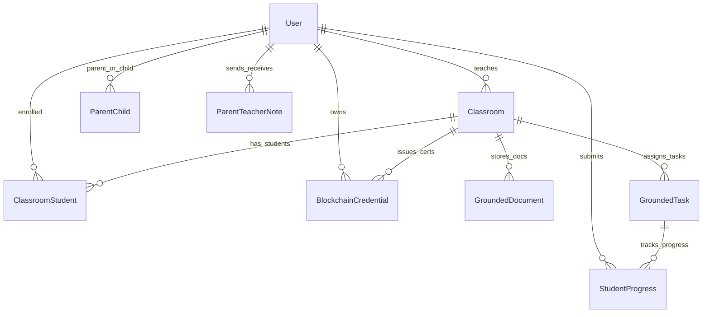
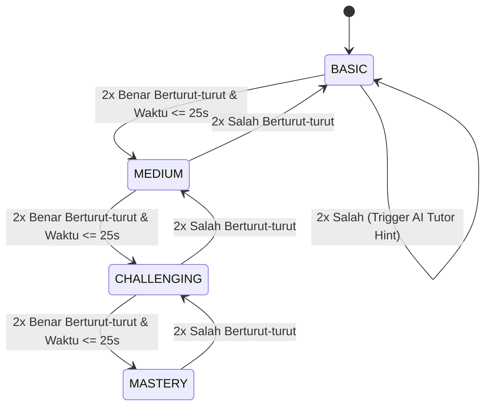

# 🛠️ System Technical Specification (SPEC.md) — EduAdapt Platform

**Nama Sistem**: EduAdapt (Platform E-Learning Adaptif K-12 Berbasis AI Brain & Blockchain Vault)  
**Institusi**: Riset Hibah Fundamental Universitas Udayana  
**Versi Dokumen**: 1.0.0  
**Status**: Approved & Implemented  
**Target Arsitektur**: Next.js 14 (App Router) + FastAPI (Python AI Engine) + ChromaDB + SQLite/Prisma + SHA-256 Blockchain Ledger  

---

## 1. Ikhtisar Sistem & Arsitektur Tingkat Tinggi (System Architecture)

EduAdapt dirancang dengan pendekatan arsitektur **Hybrid Monorepo** yang memisahkan lapisan aplikasi web interaktif (*Client & Backend Orchestration*) dengan mesin komputasi kecerdasan buatan (*AI Microservice*), diikat oleh buku besar kriptografis (*Blockchain Vault*).

```mermaid
graph TB
    subgraph ClientLayer [Client & Web Layer (Next.js 14 App Router)]
        UI_Siswa[🎮 Portal Siswa: Stepping Stones & DDA Quiz]
        UI_Guru[👩‍🏫 Portal Guru: Classroom Hub & AI Studio]
        UI_Ortu[👨‍👩‍👧 Portal Ortu: Radar Map & Wellbeing Tracker]
        UI_Verify[🔍 Halaman Verifikasi Publik Blockchain]
    end

    subgraph AppServer [Next.js Server & Backend API Engine]
        API_Routes[REST API Routes: /api/*]
        Prisma_ORM[Prisma ORM Client]
        Blockchain_Lib[Blockchain Vault Engine (SHA-256)]
        Sound_Lib[Web Audio Sound Synthesizer]
    end

    subgraph DataLayer [Storage & Persistence Layer]
        SQLite_DB[(SQLite Database / Prisma)]
        Chroma_DB[(ChromaDB Vector Store)]
    end

    subgraph AIEngine [Python FastAPI Microservice (AI Brain)]
        PDF_Parser[PyPDF Document Extractor & Chunker]
        Vector_Search[Vector Similarity Search Top-K]
        DDA_Calculator[Dynamic Difficulty Adjustment Engine]
        Gemini_Client[Google Gemini Flash Grounding Client]
    end

    UI_Siswa --> API_Routes
    UI_Guru --> API_Routes
    UI_Ortu --> API_Routes
    UI_Verify --> API_Routes

    API_Routes --> Prisma_ORM
    API_Routes --> Blockchain_Lib
    Prisma_ORM --> SQLite_DB

    API_Routes -->|HTTP / JSON Requests| AIEngine
    PDF_Parser --> Chroma_DB
    Vector_Search --> Chroma_DB
    Vector_Search --> Gemini_Client
    Gemini_Client -->|Structured JSON Task| API_Routes
    Blockchain_Lib -->|Merkle Chain Block| SQLite_DB
```

### 1.1 Komponen Inti Arsitektur
1. **Frontend & App Engine (Next.js 14)**:
   - React 18 Server & Client Components.
   - Tailwind CSS dengan sistem desain taktil 3D terkurasi (`border-b-4`, `active:translate-y-1`).
   - Web Audio API synthesizer untuk gamified sound effects tanpa beban file eksternal.
   - Next.js API Routes sebagai gateway backend utama.
2. **AI Brain Microservice (FastAPI + Python 3.10+)**:
   - Ekstraksi PDF modul ajar guru via PyPDF.
   - Semantic Chunking & Vector Search via ChromaDB.
   - Strict Grounding Prompting via Google Gemini API dengan response schema JSON terstruktur.
   - Standalone Dynamic Difficulty Adjustment (DDA) calculator.
3. **Database & Persistence (Prisma ORM + SQLite)**:
   - Manajemen relasi kelas, siswa, guru, orang tua, dokumen grounding, tugas adaptif, riwayat progres, dan ledger rantai blok.
4. **Blockchain Credential Vault (Cryptographic SHA-256 Ledger)**:
   - Hashing deterministik berbasis Merkle/Hash chaining (`blockIndex`, `previousHash`, `blockHash`, `transactionId`).
   - Sistem validasi independen untuk verifikasi ijazah mikro melalui web publik atau scan QR code.

---

## 2. Spesifikasi Skema Basis Data (Database Schema)

Basis data dikelola menggunakan **Prisma ORM** dengan provider SQLite (`prisma/schema.prisma`).



### 2.1 Definisi Entitas & Kolom

#### A. Tabel `User`
Menyimpan data identitas pengguna lintas 3 peran (Siswa, Guru, Orang Tua).
| Kolom | Tipe Data | Modifiers | Keterangan |
|---|---|---|---|
| `id` | String | PK, `@default(cuid())` | Unique user identifier |
| `email` | String | Unique | Alamat surel akun |
| `passwordHash` | String | Required | Hash kata sandi |
| `name` | String | Required | Nama lengkap pengguna |
| `role` | String | Default: `"SISWA"` | Enum: `SISWA`, `GURU`, `ORTU` |
| `learningStyle` | String | Nullable | Enum: `VISUAL`, `AUDITORI`, `KINESTETIK` |
| `xpTotal` | Int | Default: `0` | Akumulasi XP gamifikasi siswa |
| `streakDays` | Int | Default: `1` | Jumlah hari berturut-turut belajar |
| `hearts` | Int | Default: `5` | Sistem nyawa latihan siswa (1-5) |
| `createdAt` | DateTime | `@default(now())` | Waktu registrasi |

#### B. Tabel `Classroom`
Menyimpan rombongan belajar (rombel) yang dibuat oleh guru.
| Kolom | Tipe Data | Modifiers | Keterangan |
|---|---|---|---|
| `id` | String | PK, `@default(cuid())` | ID kelas |
| `name` | String | Required | Contoh: "Matematika Kelas 10-A" |
| `grade` | Int | Required | Jenjang kelas 1 – 12 (SD/SMP/SMA) |
| `subject` | String | Required | Mata pelajaran ("Matematika", "IPA", dll) |
| `joinCode` | String | Unique | 6-karakter kode gabung unik (misal: "UDU802") |
| `teacherId` | String | FK -> `User.id` | Guru penanggung jawab |
| `createdAt` | DateTime | `@default(now())` | Waktu pembuatan kelas |

#### C. Tabel `ClassroomStudent`
Tabel pivot relasi banyak-ke-banyak antara Siswa dan Kelas.
| Kolom | Tipe Data | Modifiers | Keterangan |
|---|---|---|---|
| `classroomId` | String | PK (Komposit), FK | Relasi ke `Classroom.id` (OnDelete: Cascade) |
| `studentId` | String | PK (Komposit), FK | Relasi ke `User.id` (OnDelete: Cascade) |
| `joinedAt` | DateTime | `@default(now())` | Waktu bergabung |

#### D. Tabel `GroundedDocument`
Menyimpan teks hasil parsing PDF modul ajar guru yang menjadi sumber tunggal kebenaran (grounding context).
| Kolom | Tipe Data | Modifiers | Keterangan |
|---|---|---|---|
| `id` | String | PK, `@default(cuid())` | ID dokumen materi |
| `classroomId` | String | FK -> `Classroom.id` | Kelas pemilik materi |
| `title` | String | Required | Judul modul (e.g. "Bab 3 Matriks") |
| `fileUrl` | String | Nullable | Path / URL file PDF asli |
| `rawText` | String | Required (Text) | Teks hasil ekstraksi PyPDF |
| `status` | String | Default: `"READY"` | `"PROCESSING"`, `"READY"`, `"ERROR"` |
| `createdAt` | DateTime | `@default(now())` | Waktu unggah |

#### E. Tabel `GroundedTask`
Menyimpan kuis, materi, evaluasi ulangan, atau tugas yang di-generate AI dan diverifikasi guru.
| Kolom | Tipe Data | Modifiers | Keterangan |
|---|---|---|---|
| `id` | String | PK, `@default(cuid())` | ID tugas |
| `classroomId` | String | FK -> `Classroom.id` | Kelas target |
| `type` | String | Default: `"quiz"` | `"material"`, `"quiz"`, `"exam"`, `"assignment"` |
| `title` | String | Required | Judul kuis/tugas |
| `chapter` | String | Nullable | Bab/topik materi kurikulum |
| `sourceReference` | String | Required | Kutipan grounding (e.g. "Bab 3 Hal 45") |
| `contentJson` | String | Required (JSON) | Objek `TaskContent` (soal, opsi, penjelasan) |
| `difficultyLevel` | String | Default: `"BASIC"` | `"BASIC"`, `"MEDIUM"`, `"CHALLENGING"`, `"MASTERY"` |
| `isPublished` | Boolean | Default: `true` | Status publikasi ke siswa |
| `createdAt` | DateTime | `@default(now())` | Waktu pembuatan |

#### F. Tabel `StudentProgress`
Mencatat hasil pengerjaan kuis siswa secara rinci beserta riwayat penyesuaian DDA.
| Kolom | Tipe Data | Modifiers | Keterangan |
|---|---|---|---|
| `id` | String | PK, `@default(cuid())` | ID riwayat pengerjaan |
| `studentId` | String | FK -> `User.id` | ID siswa yang mengerjakan |
| `taskId` | String | FK -> `GroundedTask.id` | ID tugas yang diselesaikan |
| `score` | Float | Required | Nilai akhir (skala 0 - 100) |
| `accuracy` | Float | Required | Rasio jawaban benar (0.0 - 1.0) |
| `timeSpentSec` | Int | Required | Total durasi pengerjaan dalam detik |
| `ddaHistoryJson`| String | Nullable (JSON) | Array riwayat perpindahan tingkat kesulitan |
| `completedAt` | DateTime | `@default(now())` | Waktu selesai |

#### G. Tabel `BlockchainCredential`
Menyimpan catatan sertifikat kompetensi permanen yang telah diminting ke dalam rantai blok kriptografis.
| Kolom | Tipe Data | Modifiers | Keterangan |
|---|---|---|---|
| `id` | String | PK, `@default(cuid())` | ID internal baris |
| `certificateId` | String | Unique | Format: `"KOG-2026-X7A9"` |
| `studentId` | String | FK -> `User.id` | Siswa penerima sertifikat |
| `classroomId` | String | FK -> `Classroom.id` | Kelas penerbit |
| `competencyTitle`| String | Required | Nama kompetensi yang dikuasai |
| `score` | Float | Required | Nilai pencapaian kompetensi |
| `blockIndex` | Int | Required | Nomor urut blok dalam ledger (0, 1, 2...) |
| `previousHash` | String | Required | Hash SHA-256 blok sebelumnya |
| `blockHash` | String | Unique | Hash SHA-256 blok ini |
| `transactionId` | String | Unique | Transaction ID berformat `0x...` |
| `verifiedBy` | String | Required | Nama otoritas ("Universitas Udayana") |
| `issuedAt` | DateTime | `@default(now())` | Timestamp penerbitan |

#### H. Tabel `ParentChild` & `ParentTeacherNote`
- **`ParentChild`**: Menghubungkan orang tua (`parentId`) dengan satu atau banyak anak (`childId`).
- **`ParentTeacherNote`**: Pesan komunikasi/konsultasi berkala antara orang tua dan guru wali kelas.

---

## 3. Spesifikasi Dynamic Difficulty Adjustment (DDA Engine)

DDA Engine mengatur tingkat kesulitan soal berikutnya secara instan dan personal berdasarkan parameter performa waktu nyata (*real-time cognitive feedback*).

### 3.1 Tingkatan Kesulitan (Difficulty Hierarchy)
```
[1] BASIC  -->  [2] MEDIUM  -->  [3] CHALLENGING  -->  [4] MASTERY
```

### 3.2 Aturan Transisi Keadaan (State Transition Rules)



### 3.3 Logika Matematis & Algoritma Kalkulasi
- **Kondisi Level Up (`LEVEL_UP`)**:
  $$\text{isCorrect} = \text{true} \quad \land \quad \text{consecutiveCorrect} \ge 2 \quad \land \quad T_{\text{response}} \le 25.0\text{ detik}$$
  *Aksi*: Tingkat dinaikkan satu level ke atas ($Idx \leftarrow Idx + 1$).
- **Kondisi Level Down (`LEVEL_DOWN`)**:
  $$\text{isCorrect} = \text{false} \quad \land \quad \text{consecutiveIncorrect} \ge 2 \quad \land \quad Idx > 0$$
  *Aksi*: Tingkat diturunkan satu level ke bawah ($Idx \leftarrow Idx - 1$), `aiTutorSuggested` disetel `true`.
- **Kondisi Bantuan Dasar (`OFFER_HINT`)**:
  $$\text{isCorrect} = \text{false} \quad \land \quad \text{consecutiveIncorrect} \ge 2 \quad \land \quad Idx = 0$$
  *Aksi*: Tingkat tetap pada `BASIC`, sistem otomatis memunculkan modal bantuan AI Companion.
- **Kondisi Stabil (`MAINTAIN`)**:
  Kondisi di luar kriteria di atas mempertahankan tingkat kesulitan aktif.

---

## 4. Spesifikasi Mesin Kriptografi Blockchain Vault

Blockchain Vault berfungsi sebagai **Buku Besar Kredensial Akademik Anti-Manipulasi**.

### 4.1 Struktur Payload Blok Kriptografi
Formula hashing deterministik menggunakan algoritma **SHA-256**:

$$\text{BlockHash} = \text{SHA256}(\text{blockIndex} \parallel \text{previousHash} \parallel \text{studentId} \parallel \text{certificateId} \parallel \text{score.toFixed(2)} \parallel \text{timestamp})$$

$$\text{TransactionId} = \text{"0x"} + \text{SHA256}(\text{BlockHash} \parallel \text{certificateId})$$

### 4.2 Genesis Block
- **`blockIndex`**: `0`
- **`previousHash`**: `"0000000000000000000000000000000000000000000000000000000000000000"` (64 karakter nol)
- **`certificateId`**: `"GENESIS-ROOT-UDU-2026"`

### 4.3 Algoritma Verifikasi Integritas Data
Setiap sertifikat yang dipanggil melalui hash atau ID akan dihitung ulang hash-nya secara mandiri:
```typescript
function verifyBlockIntegrity(block: BlockchainBlock): VerificationResult {
  const computedHash = generateBlockHash(
    block.blockIndex,
    block.previousHash,
    block.studentId,
    block.certificateId,
    block.score,
    block.timestamp
  );
  
  const isValid = (computedHash === block.blockHash);
  return { isValid, computedHash, recordedHash: block.blockHash, ... };
}
```
Jika data dimanipulasi pada basis data (misalnya nilai siswa diubah dari 70 menjadi 100), `computedHash` tidak akan cocok dengan `blockHash`, sehingga status verifikasi instan ditolak dengan pesan peringatan tamper kriptografis.

---

## 5. Spesifikasi AI RAG Pipeline & Anti-Halusinasi (AI Brain)

### 5.1 Alur Pemrosesan Dokumen PDF
1. **Ekstraksi Teks**: PyPDF membaca binary file modul yang diunggah guru, menghapus format biner dan mengekstrak teks utf-8 mentah.
2. **Recursive Text Chunking**:
   - Ukuran Chunk: ~800 karakter.
   - Chunk Overlap: 150 karakter (mempertahankan kontinuitas makna antar potongan).
3. **Penyimpanan Vektor**: Chunk disimpan ke dalam koleksi ChromaDB lokal yang diisolasi per `classroomId`.

### 5.2 Strategi Grounding & Prompt Template
AI Generator diwajibkan menyertakan kutipan dokumen spesifik pada setiap soal yang dibuat:

```
[SYSTEM PROMPT CONSTRAINTS]
Anda adalah Kognita AI Grounded Curriculum Generator.
Aturan Wajib:
1. HANYA gunakan konteks dokumen guru yang disediakan di bawah.
2. DILARANG membuat asumsi atau fakta di luar teks materi guru (Zero Hallucination Policy).
3. Sertakan referensi spesifik halaman/bab pada field 'sourceReference'.
4. Kembalikan 100% respons dalam format JSON valid sesuai skema.
```

### 5.3 Mode Penjelasan AI Tutor (Companion Cues)
Saat siswa menekan tombol AI Tutor, sistem menyediakan 3 mode penjelasan kognitif:
1. **`analogi`**: Menjelaskan konsep abstrak menggunakan perumpamaan sehari-hari yang ramah anak.
2. **`visual`**: Memberikan petunjuk visual berupa deskripsi visual atau diagram Mermaid sederhana.
3. **`langkah`**: Panduan berpikir terstruktur langkah demi langkah (step-by-step reasoning) tanpa langsung membocorkan jawaban akhir.

---

## 6. Spesifikasi Antarmuka API (API Contracts)

### 6.1 Next.js API Routes

#### 1. `POST /api/classes`
Membuat kelas baru atau mendaftarkan siswa ke kelas.
- **Request Body (Buat Kelas Baru - Guru)**:
  ```json
  {
    "action": "create",
    "name": "Matematika Kelas 10-A",
    "grade": 10,
    "subject": "Matematika",
    "teacherId": "clx_teacher_01"
  }
  ```
- **Request Body (Gabung Kelas - Siswa)**:
  ```json
  {
    "action": "join",
    "joinCode": "UDU802",
    "studentId": "clx_student_01"
  }
  ```
- **Response**: `200 OK` `{ "success": true, "data": { ... } }`

#### 2. `GET /api/tasks?classId={classId}&studentId={studentId}`
Mengambil daftar tugas/kuis dalam kelas beserta status penyelesaian siswa.
- **Response**:
  ```json
  {
    "success": true,
    "data": [
      {
        "id": "task_01",
        "title": "Logika Matematika & Aljabar",
        "type": "quiz",
        "difficultyLevel": "BASIC",
        "isCompleted": false,
        "score": null
      }
    ]
  }
  ```

#### 3. `POST /api/progress`
Menyimpan progres hasil pengerjaan kuis siswa dan auto-minting sertifikat blockchain jika lulus.
- **Request Body**:
  ```json
  {
    "studentId": "clx_student_01",
    "taskId": "task_01",
    "score": 100.0,
    "accuracy": 1.0,
    "timeSpentSec": 65,
    "ddaHistory": [ ... ]
  }
  ```
- **Response**:
  ```json
  {
    "success": true,
    "progressId": "prog_991",
    "credentialMinted": {
      "certificateId": "KOG-2026-X7A9",
      "transactionId": "0x4a9b...c1",
      "blockHash": "e3b0c44298fc1c149afbf4c8996fb92427ae41e4649b934ca495991b7852b855"
    }
  }
  ```

#### 4. `GET /api/verify/[hash]`
Memeriksa validitas sertifikat secara publik.
- **URL Parameter**: `hash` (Block Hash atau Transaction ID atau Certificate ID)
- **Response**:
  ```json
  {
    "success": true,
    "data": {
      "isValid": true,
      "certificateId": "KOG-2026-MAT-001",
      "studentName": "Budi Pratama",
      "className": "Matematika Kelas 10-A",
      "competencyTitle": "Logika Matematika & Aljabar",
      "score": 100,
      "blockHash": "c7bf9197...",
      "transactionId": "0x9812...",
      "verifiedBy": "Universitas Udayana & Riset Fundamental",
      "timestamp": "2026-08-17T08:30:00.000Z"
    }
  }
  ```

#### 5. `POST /api/assessment`
Menyimpan hasil asesmen diagnostik gaya belajar (Visual, Auditori, Kinestetik).
- **Request Body**:
  ```json
  {
    "studentId": "clx_student_01",
    "learningStyle": "VISUAL"
  }
  ```

#### 6. `POST /api/notes`
Mengirim catatan konsultasi antara orang tua dan guru.
- **Request Body**:
  ```json
  {
    "senderId": "user_parent_01",
    "receiverId": "user_teacher_01",
    "studentId": "user_student_01",
    "message": "Bagaimana perkembangan matematika Budi minggu ini?"
  }
  ```

---

### 6.2 FastAPI AI Engine Endpoints

| Method | Endpoint | Fungsi | Payload Utama |
|---|---|---|---|
| `GET` | `/health` | Pemeriksaan kesehatan microservice | - |
| `POST` | `/api/ai/extract-pdf` | Upload PDF & indexing ke ChromaDB | `file: UploadFile`, `classroomId: Form(...)` |
| `POST` | `/api/ai/generate-task` | Generate soal kuis RAG ter-grounding | `{ classroomId, topic, targetDifficulty, numQuestions }` |
| `POST` | `/api/ai/companion-hint` | Ambil petunjuk AI Companion | `{ questionText, mode, learningStyle }` |
| `POST` | `/api/ai/dda-calculate` | Kalkulasi kesulitan DDA standalone | `{ currentLevel, isCorrect, responseTimeSec, consecutiveCorrect, consecutiveIncorrect }` |

---

## 7. Spesifikasi Desain UI/UX & Gamifikasi Taktil

### 7.1 Standar Tombol 3D Taktil
Setiap tombol aksi interaktif memiliki struktur elevasi 3 dimensi:
- **Tinggi Border Bawah**: `border-b-4`
- **Interaksi Klik (Active)**: `active:border-b-0 active:translate-y-1`
- **Variasi Warna Tematik**:
  - Hijau Sukses / Mulai: `bg-[#58cc02] border-[#46a302]`
  - Biru Info / AI Tutor: `bg-[#1cb0f6] border-[#1899d6]`
  - Kuning Emas / Level Up: `bg-[#ffc800] border-[#e5a400]`
  - Ungu Gems / Spesial: `bg-[#ce82ff] border-[#a855f7]`
  - Merah Peringatan: `bg-[#ff4b4b] border-[#ea2b2b]`

### 7.2 Stepping Stone Path (Jalur Belajar Siswa)
- **Node Status**:
  1. `LOCKED`: Abu-abu netral, ikon gembok, tidak dapat diklik.
  2. `ACTIVE`: Kuning/Hijau terang, animasi pulsing/bounce halus, ada mahkota/bintang di atasnya.
  3. `COMPLETED`: Hijau solid, centang emas, skor kelulusan tersimpan.
- **Node Types**:
  - `REGULAR`: Lingkaran standar 64px untuk kuis harian.
  - `MILESTONE / BOSS`: Lingkaran besar 80px dengan ornamen mahkota emas untuk ulangan evaluasi bab.

### 7.3 Sintesis Audio Gamifikasi (Web Audio API)
Tanpa ketergantungan file MP3 eksternal, audio di-render langsung via `AudioContext`:
- `playClickSound()`: Sine wave 600Hz -> 800Hz durasi 0.08 detik.
- `playSuccessSound()`: Tri-tone chord manis (523Hz [C5], 659Hz [E5], 784Hz [G5]) durasi 0.35 detik.
- `playErrorSound()`: Low square wave 180Hz durasi 0.2 detik.
- `playLevelUpSound()`: Arpeggio menaik 4-nada (C5, E5, G5, C6) durasi 0.5 detik.

---

## 8. Spesifikasi Keamanan, Privasi & Kepatuhan K-12

1. **Role-Based Access Control (RBAC)**:
   - Siswa hanya dapat mengakses jalur belajarnya, mengerjakan tugas kelas yang terdaftar, dan melihat sertifikat pribadinya.
   - Guru memiliki hak akses penuh terhadap manajemen kurikulum, pembuatan kelas, unggah modul, dan buku nilai siswa di kelasnya.
   - Orang Tua hanya dapat melihat data anak yang sudah terhubung lewat relasi `ParentChild`.
2. **Kedaulatan Konten Guru (Anti-Halusinasi)**:
   - Mesin RAG dikunci 100% pada dokumen guru di dalam `classroomId` yang bersangkutan. Prompt AI dilarang mengambil pengetahuan eksternal yang bertentangan dengan materi guru.
3. **Data Protection & Child Safety**:
   - Tidak ada pengumpulan data pribadi sensitif anak di luar nama dan capaian belajar.
   - Seluruh hash blockchain bersifat pseudonim dan terproteksi secara kriptografis.

---

## 9. Rencana Verifikasi & Standar Pengujian Kualitas (QA)

| Kategori Pengujian | File Test | Target Hasil |
|---|---|---|
| **CRUD Database & Relasi** | `tests/db.test.ts` | 100% query User, Classroom, Task, Progress sukses tanpa constraint failure |
| **Kriptografi Blockchain** | `tests/blockchain.test.ts` | SHA-256 hash chaining valid, deteksi tamper 100% akurat saat data diubah |
| **Logika DDA Engine** | `ai-engine/tests/test_dda_and_grounding.py` | Akurasi transisi level up/down sesuai waktu respons dan streak jawaban |
| **End-to-End Flow Integration** | `tests/e2e-flow.test.ts` | Simulasi lengkap: Guru buat kelas -> Upload modul -> Siswa kerjakan DDA -> Mint Blockchain Cert -> Verifikasi Publik -> Konsultasi Ortu |

---

## 10. Matriks Variabel Lingkungan (Environment Configuration)

File konfigurasi `.env` pada root Next.js:

```bash
# Database
DATABASE_URL="file:./dev.db"

# AI Microservice Bridge
AI_SERVICE_URL="http://localhost:8000"

# Google Gemini API
GEMINI_API_KEY="your_gemini_api_key_here"

# Blockchain Configuration
NEXT_PUBLIC_BLOCKCHAIN_AUTHORITY="Universitas Udayana & Riset Fundamental"
NEXT_PUBLIC_APP_URL="http://localhost:3000"
```

---

## 11. Kesimpulan & Referensi Dokumen Terkait

Spesifikasi teknis ini menjadi acuan utama bagi pengembang, penguji sistem, dan peneliti dalam memelihara dan mengembangkan platform **EduAdapt**.

- Dokumen Kebutuhan Produk: [PRD.md](file:///c:/Users/LENOVO/OneDrive/Desktop/Platform%20HPF/PRD.md)
- Dokumen Sistem Desain & UI/UX: [DESIGN.md](file:///c:/Users/LENOVO/OneDrive/Desktop/Platform%20HPF/DESIGN.md)
- Rencana Implementasi: [2026-08-17-kognita-platform-plan.md](file:///c:/Users/LENOVO/OneDrive/Desktop/Platform%20HPF/docs/superpowers/plans/2026-08-17-kognita-platform-plan.md)
