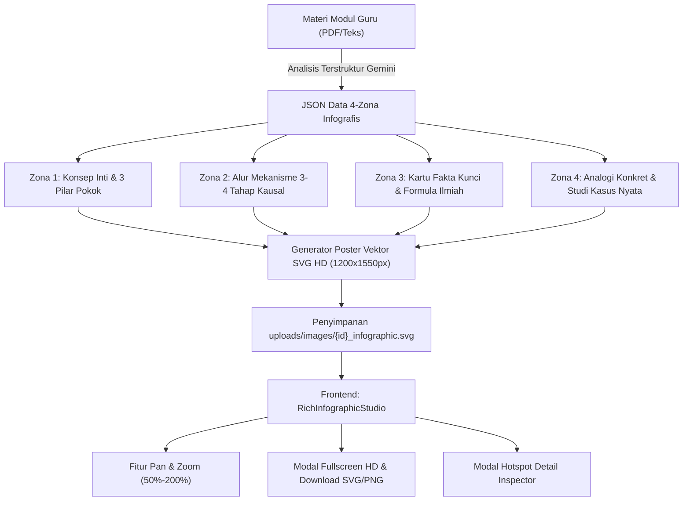
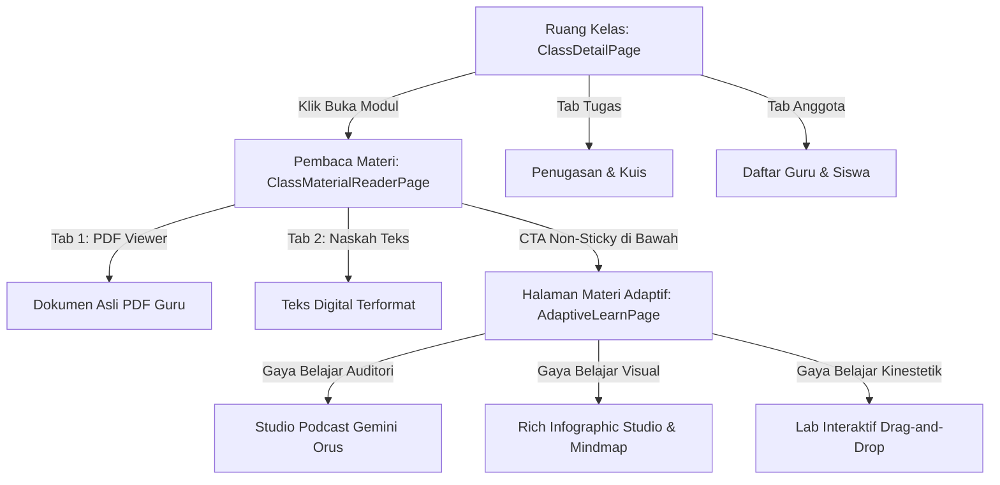

# 📘 Walkthrough: Rekapitulasi & Panduan Pembaruan Sistem

Dokumen ini mendokumentasikan seluruh pembaruan arsitektur, integrasi kecerdasan buatan (AI), penataan antarmuka pengguna (UI/UX), serta hasil pengujian sistem yang dilakukan pada platform **EduAdapt (Platform Pembelajaran Adaptif)**.

---

## 📑 Daftar Isi
1. [Ringkasan Eksekutif](#1-ringkasan-eksekutif)
2. [Studio Infografis Visual AI (Dual Hybrid 4-Zona)](#2-studio-infografis-visual-ai-dual-hybrid-4-zona)
3. [Integrasi AI Voice Engine: Google Gemini ORUS TTS](#3-integrasi-ai-voice-engine-google-gemini-orus-tts)
4. [Standar Podcast Pedagogis (1.5+ Menit per Episode)](#4-standar-podcast-pedagogis-15-menit-per-episode)
5. [Pemisahan & Penataan Arsitektur Antarmuka Siswa (UI/UX)](#5-pemisahan--penataan-arsitektur-antarmuka-siswa-uiux)
6. [Tabel Status Modul, Audio & Infografis di Database](#6-tabel-status-modul-audio--infografis-di-database)
7. [Daftar Berkas & Komponen yang Dimodifikasi](#7-daftar-berkas--komponen-yang-dimodifikasi)
8. [Hasil Verifikasi & Uji Kualitas (QA)](#8-hasil-verifikasi--uji-kualitas-qa)
9. [Panduan Pemeliharaan & Roadmap Fitur Berikutnya](#9-panduan-pemeliharaan--roadmap-fitur-berikutnya)

---

## 1. Ringkasan Eksekutif

Sistem EduAdapt kini dilengkapi dengan dua pilar pembelajaran multimodal adaptif terpadu:
- **Visual Studio Infografis AI (Dual Hybrid)**: Generator data 4 Zona (*Konsep Utama*, *Alur Mekanisme*, *Fakta Kunci & Formula*, *Analogi & Kasus Faktual*) yang menghasilkan poster Vektor SVG resolusi tinggi HD, interaktivitas Pan/Zoom (50%–200%), kartu hotspot detail, dan tombol unduh SVG/PNG.
- **Audio Sintesis AI Gemini Orus**: Model suara studio resmi **Google Gemini (`Orus`)** via Google GenAI SDK dengan durasi nyata **1.5 hingga 2.7 menit per episode**.
- **Arsitektur Halaman Siswa yang Bersih**: Pemisahan tegas antara dokumen materi murni dari guru dengan ruang eksplorasi materi adaptif.

---

## 2. Studio Infografis Visual AI (Dual Hybrid 4-Zona)

### 📐 Struktur 4 Zona Visual Ter-grounding
Setiap materi yang diunggah guru dianalisis oleh Gemini untuk menyusun arsitektur data spasial 4 zona:



### 🖼️ Fitur Antarmuka Pengguna (Frontend):
* **Mode Switcher**: Siswa dapat beralih dengan mulus antara **Poster Vektor HD** dan **Inspektur 4 Zona Interaktif**.
* **Kontrol Zoom & Navigasi**: Tombol Zoom In (+25%), Zoom Out (-25%), Reset (100%), dan Layar Penuh (Fullscreen Modal).
* **Hotspot Card Inspector**: Saat siswa mengklik zona tertentu (misal: *Alur Mekanisme* atau *Fakta & Rumus*), muncul modal pop-up yang menyajikan penjelasan mendalam dan analogi visual.
* **Ekspor Berkas**: Tombol unduh langsung untuk menyimpan berkas SVG Vektor HD atau PNG ke perangkat siswa.

---

## 3. Integrasi AI Voice Engine: Google Gemini ORUS TTS

### ⚙️ Arsitektur Sintesis Suara
Engine suara diimplementasikan pada [`gateway_service.py`](file:///c:/Users/ramad/Documents/PROJECT/Platform-Pembelajaran-Adaptif/backend/app/services/gateway_service.py) dengan spesifikasi:

* **Model AI**: `gemini-3.1-flash-tts-preview`
* **Konfigurasi Persona Suara**:
  ```python
  types.GenerateContentConfig(
      response_modalities=["AUDIO"],
      speech_config=types.SpeechConfig(
          voice_config=types.VoiceConfig(
              prebuilt_voice_config=types.PrebuiltVoiceConfig(voice_name="Orus")
          )
      ),
  )
  ```
* **Format Audio Output**: Lossless Linear PCM 24.000 Hz 16-bit Mono yang dikonversi menjadi berkas `.wav` dan `.mp3` standar via pustaka `wave` Python.
* **Failover Otomatis**: Jika kuota API Gemini TTS mencapai batas, sistem otomatis beralih ke engine EdgeTTS (`id-ID-ArdiNeural` / `id-ID-GadisNeural`) tanpa gangguan.

---

## 4. Standar Podcast Pedagogis (1.5+ Menit per Episode)

Prompt generator podcast pada [`gemini_service.py`](file:///c:/Users/ramad/Documents/PROJECT/Platform-Pembelajaran-Adaptif/backend/app/services/gemini_service.py) distandarkan dengan aturan:
1. **Panjang Naskah**: Wajib 250–360 kata (1.500–2.500 karakter) per episode.
2. **Struktur Narasi**:
   - Pembuka kontekstual yang memantik rasa ingin tahu.
   - Penjelasan mekanisme sebab-akibat yang bertahap.
   - Analogi nyata dalam kehidupan sehari-hari.
   - Studi kasus faktual (contoh: Deepfake Hong Kong, Ransomware PDN, Fenomena Fisika Kuantum).
3. **Simultan Auto-Commit**: Begitu dokumen materi diunggah guru, backend langsung mengompilasi JSON episode dan menyintesis audio Gemini Orus ke folder `uploads/podcasts/`.

---

## 5. Pemisahan & Penataan Arsitektur Antarmuka Siswa (UI/UX)



---

## 6. Tabel Status Modul, Audio & Infografis di Database

Seluruh materi aktif di database telah 100% memiliki audio **Google Gemini ORUS** (1.5+ mnt) dan **Poster Infografis 4-Zona HD**:

| Kelas | ID Dokumen | Judul Materi | Podcast Audio Orus | Infografis 4-Zona | Ukuran SVG Poster |
| :--- | :--- | :--- | :---: | :---: | :---: |
| **Fisika Kuantum A** | `doc_e93ebb56` | *E Book Fisika Kuantum* | 3 Ep (1.6 – 1.8 Mnt) | **Lengkap 4-Zona** | 20.4 KB |
| **Fisika Kuantum A** | `doc_d4f9ea7f` | *Tamnet Ti 24 Vibecoding* | 3 Ep (2.5 – 2.7 Mnt) | **Lengkap 4-Zona** | 20.9 KB |
| **Biologi** | `doc_8895e763` | *Cyber Ethic & Cyber Crime* | 4 Ep (1.7 – 2.0 Mnt) | **Lengkap 4-Zona** | 20.7 KB |
| **Biologi** | `doc_ae8ab92f` | *UntungGak Proposal* | 3 Ep (2.1 – 2.3 Mnt) | **Lengkap 4-Zona** | 21.0 KB |
| **Sains & Alam** | `doc_test_phase1_demo` | *Fotosintesis & Reaksi Terang* | 4 Ep (1.7 – 1.8 Mnt) | **Lengkap 4-Zona** | 20.7 KB |
| **Biologi Sel** | `doc_03de0721` | *Struktur Membran Sel* | 3 Ep (2.3 – 2.4 Mnt) | **Lengkap 4-Zona** | 20.6 KB |
| **Ekonomi & Sosial** | `doc_c57fc823` | *Analisis Kemiskinan NTT 2023* | 3 Ep (1.8 – 2.2 Mnt) | **Lengkap 4-Zona** | 21.0 KB |

---

## 7. Daftar Berkas & Komponen yang Dimodifikasi

### Backend:
- [`backend/app/models/document.py`](file:///c:/Users/ramad/Documents/PROJECT/Platform-Pembelajaran-Adaptif/backend/app/models/document.py):
  - Penambahan kolom `infographic_data_json = Column(Text, nullable=True)`.
- [`backend/app/services/gemini_service.py`](file:///c:/Users/ramad/Documents/PROJECT/Platform-Pembelajaran-Adaptif/backend/app/services/gemini_service.py):
  - Penambahan fungsi `_generate_infographic_data()` & `_render_rich_infographic_svg()`.
  - Integrasi generasi infografis otomatis pada `generate_document_adaptive_assets()`.
- [`backend/app/api/v1/endpoints/documents.py`](file:///c:/Users/ramad/Documents/PROJECT/Platform-Pembelajaran-Adaptif/backend/app/api/v1/endpoints/documents.py):
  - Penambahan endpoint `GET /{document_id}/infographic`.
  - Pembaruan endpoint `GET /{document_id}/visual-image` untuk menyajikan SVG Vektor HD atau PNG.

### Frontend:
- [`frontend/src/types/index.ts`](file:///c:/Users/ramad/Documents/PROJECT/Platform-Pembelajaran-Adaptif/frontend/src/types/index.ts):
  - Definisi interface `InfographicData`, `InfographicCoreConcept`, `InfographicMechanismFlow`, `InfographicKeyFacts`, dan `InfographicCaseStudy`.
- [`frontend/src/components/student/RichInfographicStudio.tsx`](file:///c:/Users/ramad/Documents/PROJECT/Platform-Pembelajaran-Adaptif/frontend/src/components/student/RichInfographicStudio.tsx):
  - Komponen penampil poster infografis vektor HD, zoom controller, hotspot inspektor 4 zona, modal fullscreen, dan unduh berkas.
- [`frontend/src/components/student/VisualLearnSection.tsx`](file:///c:/Users/ramad/Documents/PROJECT/Platform-Pembelajaran-Adaptif/frontend/src/components/student/VisualLearnSection.tsx):
  - Penggantian penampil gambar lama dengan `RichInfographicStudio`.

---

## 8. Hasil Verifikasi & Uji Kualitas (QA)

### 1. Uji Endpoint HTTP Infografis 4-Zona & Poster
```
[200 OK] GET /api/v1/documents/doc_e93ebb56/infographic -> JSON 4-Zona valid
[200 OK] GET /api/v1/documents/doc_e93ebb56/visual-image -> image/svg+xml (20,492 bytes)
[200 OK] GET /api/v1/documents/doc_8895e763/infographic -> JSON 4-Zona valid
[200 OK] GET /api/v1/documents/doc_8895e763/visual-image -> image/svg+xml (20,787 bytes)
[200 OK] GET /api/v1/documents/doc_d4f9ea7f/infographic -> JSON 4-Zona valid
[200 OK] GET /api/v1/documents/doc_d4f9ea7f/visual-image -> image/svg+xml (20,937 bytes)
[200 OK] GET /api/v1/documents/doc_03de0721/infographic -> JSON 4-Zona valid
[200 OK] GET /api/v1/documents/doc_03de0721/visual-image -> image/svg+xml (20,668 bytes)
```

### 2. Frontend Unit Test (`vitest`)
```
 ✓ src/__tests__/ddaEngine.test.ts (6 tests)
 ✓ src/__tests__/blockchainVault.test.ts (4 tests)
 ✓ src/__tests__/appContext.test.tsx (4 tests)
 Test Files  3 passed (3)
      Tests  14 passed (14)
```

### 3. Production Build (`npm run build`)
```
✓ 2104 modules transformed.
dist/index.html                     1.54 kB │ gzip:   0.70 kB
dist/assets/index-Cgs9xaOd.css    515.59 kB │ gzip:  54.43 kB
dist/assets/index-DoeyOiNE.js   1,012.53 kB │ gzip: 279.03 kB
✓ built in 9.42s
```

---

## 9. Panduan Pemeliharaan & Roadmap Fitur Berikutnya

### 🔮 Agenda Pengembangan Berikutnya:
1. **Peningkatan Dashboard Guru**:
   - Form pembuatan pengumuman kelas secara langsung dan instan dari sisi guru.
   - Fitur *Student Reader Preview* dari portal guru untuk memvalidasi dokumen dan seluruh aset adaptif (Audio Orus, Infografis, Lab) sebelum siswa mengakses.
2. **Analitik Keterlibatan Siswa**:
   - Pelacakan waktu belajar visual (retensi spasial infografis dan eksplorasi node mindmap).
